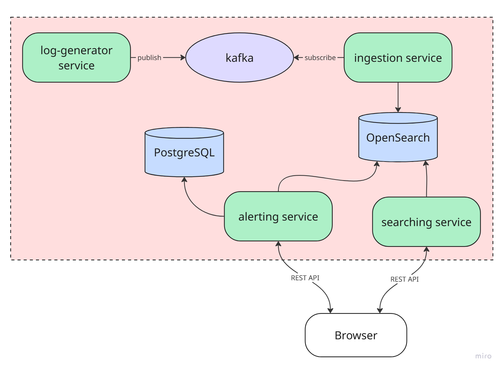

## Log analizer
Упрощенная система работы с логами.
Учебный проект, выполненный на практике в SberTech.

### Стек технологий:
Java 21, Spring Boot, Kafka, OpenSearch, PostgreSql

### Архитектура

Микросервисы:
- log-generator service. Сервис-заглушка, генерирует логи, отправляет их 
в топик kafka либо в файл .log
- ingestion service. Забирает логи из топиков kafka, либо из файла. 
Отправляет логи в OpenSearch
- searching service. Предоставляет api для поиска логов в OpenSearch
- alerting service. Предоставляет api для настройки условий для уведомления,
 хранит эти настройки в postgres, при достижении условия отправляет уведомление 
 по почте.

